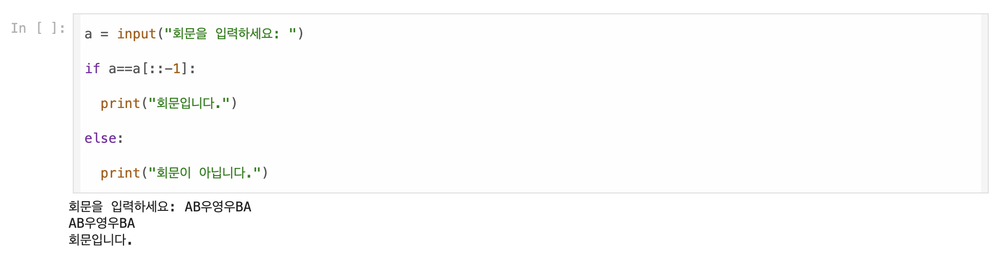

# AIFFEL Campus Online Code Peer Review Templete
- 코더 : 윤석진
- 리뷰어 : 김우찬


# PRT(Peer Review Template)
- [O]  **1. 주어진 문제를 해결하는 완성된 코드가 제출되었나요?**
    - 문제에서 요구하는 최종 결과물이 잘 첨부되었습니다.
        
    
- [O]  **2. 전체 코드에서 가장 핵심적이거나 가장 복잡하고 이해하기 어려운 부분에 작성된 
주석 또는 doc string을 보고 해당 코드가 잘 이해되었나요?**
    - if a==a[::-1]:
    - 가장 핵심적인 코드, 이해가 잘 되었습니다.
        
        
- [O]  **3. 에러가 난 부분을 디버깅하여 문제를 해결한 기록을 남겼거나
새로운 시도 또는 추가 실험을 수행해봤나요?**
    - \t와 관련된 실험을 수행하셨습니다.
    - 문제 원인 및 해결 과정을 잘 기록하였는지 확인 : 네
    - 프로젝트 평가 기준에 더해 추가적으로 수행한 나만의 시도, 
    실험이 기록되어 있는지 확인 : 네
         
        
- [O]  **4. 회고를 잘 작성했나요?**
    - 잘 작성해주셨습니다.
        - 중요! 잘 작성되었다고 생각되는 부분을 캡쳐해 근거로 첨부
        
- [O]  **5. 코드가 간결하고 효율적인가요?**
    - 파이썬 스타일 가이드 (PEP8)는 아직 제가 잘 몰라서.. 간결합니다!


# 회고(참고 링크 및 코드 개선)
```
# 코드를 아주 잘 작성해주신 것 같습니다.
# 코드 같은 줄 우측에 주석으로 해당 코드를 입력한 이유나 오류를 겪었던 부분이 있다면 더 적어주시면 초보자인 저에게 큰 도움이 될 것 같습니다.

```
