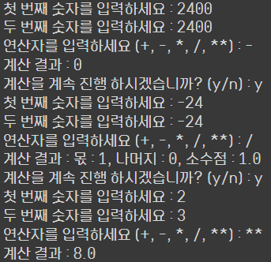
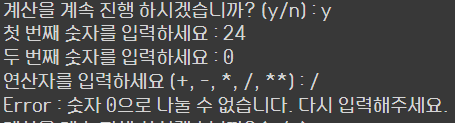
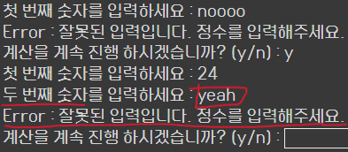
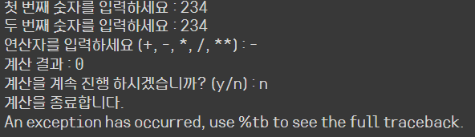
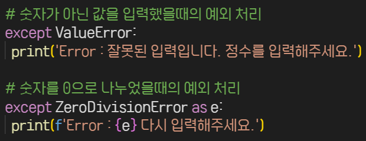
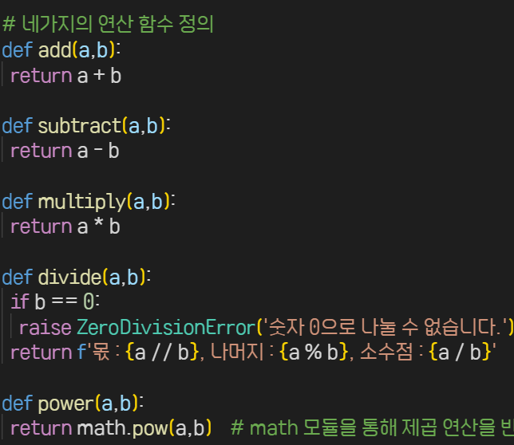

# AIFFEL Campus Online Code Peer Review Templete
- 코더: 윤석진
- 리뷰어 : 김승기


# PRT(Peer Review Template)
- [V]  **1. 주어진 문제를 해결하는 완성된 코드가 제출되었나요?**
    - 모든 조건에 부합하는 코드입니다.

	
	
	
	

    
- [V]  **2. 전체 코드에서 가장 핵심적이거나 가장 복잡하고 이해하기 어려운 부분에 작성된 
주석 또는 doc string을 보고 해당 코드가 잘 이해되었나요?**
    - 이번 퀘스트에서 가장 중요한 try-except 구문의 
      except를 완벽히 이해하고 잘 활용했다고 생각합니다.
    - 주석 또한 잘 쓰여있어 코드를 해석하는데 도움이 됩니다.

        
        
- [ ]  **3. 에러가 난 부분을 디버깅하여 문제를 해결한 기록을 남겼거나
새로운 시도 또는 추가 실험을 수행해봤나요?**
    - 에러가 난 부분을 기록한 내용은 없습니다.

        
- [V]  **4. 회고를 잘 작성했나요?**
    - 다른 코더와 같이 작업하며 배운 내용이 적혀있습니다.

        
- [V]  **5. 코드가 간결하고 효율적인가요?**
    - 네가지의 연산을 수행하는 부분을 함수화하였고 
      코드가 전체적으로 가독성있게 작성되었습니다.

	


# 회고(참고 링크 및 코드 개선)
```
except문 옆에 오류 값을 넣어 예외 처리를 한 것이 인상깊었습니다.
이 코드를 보고 try-except문을 활용하는 법의 정석을 보는 것 같았습니다.
예외처리 구문을 다시 한 번 배웠습니다.

```
